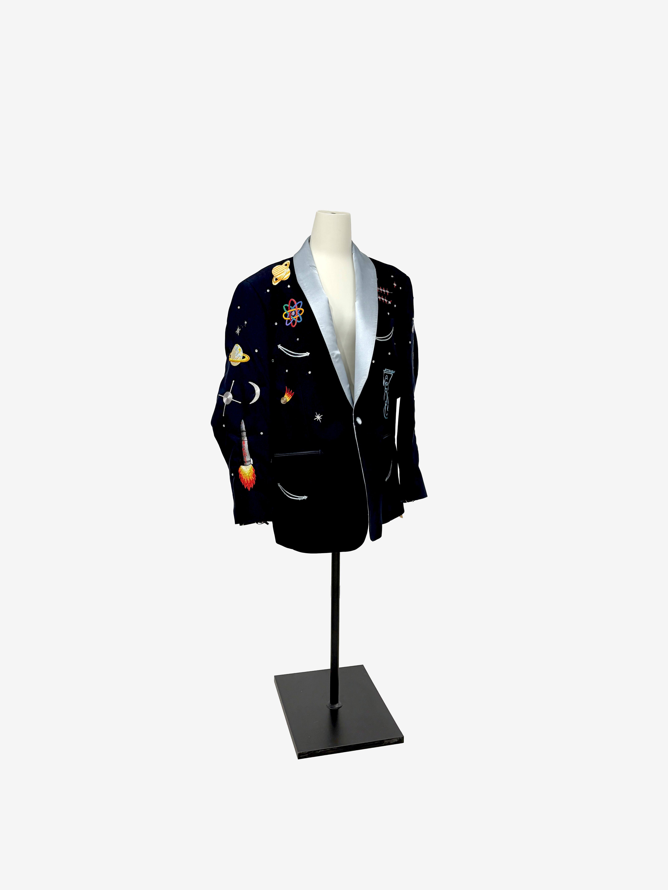
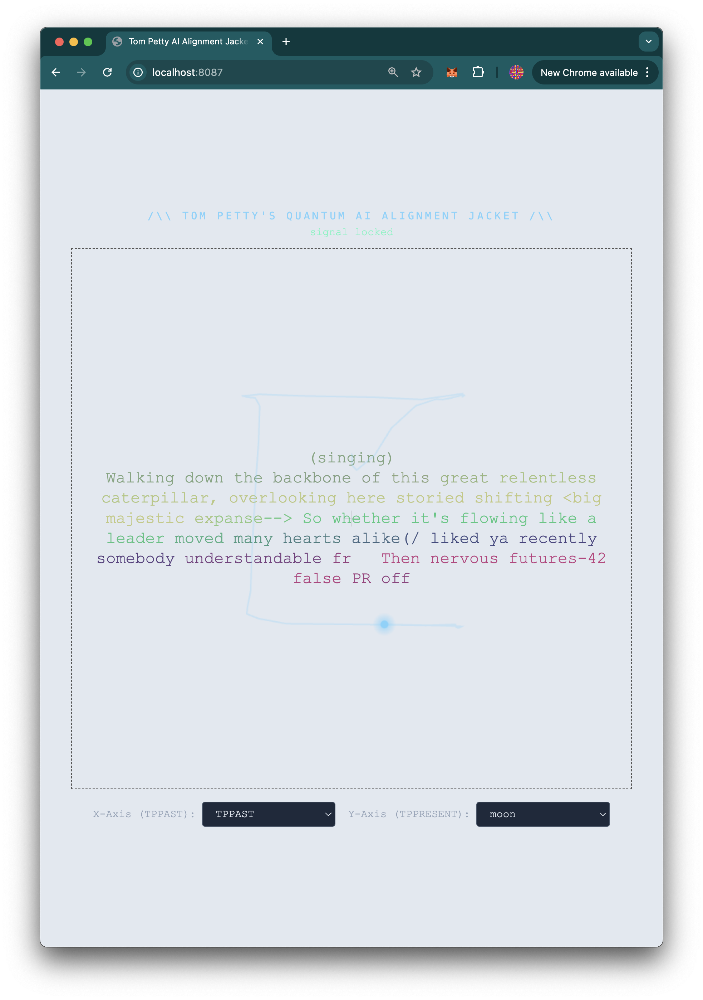

# TOM PETTY'S QUANTUM AI ALIGNMENT JACKET

`cd live` 
then
`uv sync` 
then 
`uv run main.py`

warn: Will download llama-3-3B on start

Will connect to the ble devices and control the generator of the llm using control vectors (see https://github.com/isaac-art/cvec_web )

Main interaction code in /live dir

Embroidery patches in /emb dir

Xiao NRF52840 Sense code in /esp_xiao_control dir

early demo of audio controller in /local_py_control dir

REQS:
im using vgel's repeng code for training and applying control vectors https://github.com/vgel/repeng

you need to also add audio files to live/audio dir or itll crash. (looks for bass.mp3, drums.mp3, other.mp3)